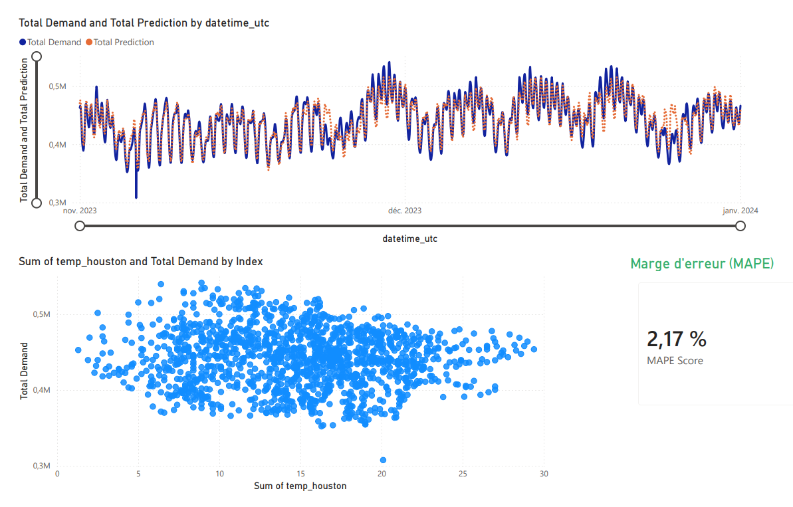

#  End-to-End Energy Forecasting Project (US Data)

##  Aperçu du Projet
Ce projet est un pipeline de données complet (**Data Engineering → Data Science → BI**) visant à prédire la consommation électrique des États-Unis (US48) heure par heure.
L'objectif est d'aider à l'équilibrage du réseau électrique en anticipant la demande grâce au Machine Learning.

**Résultat :** Modèle XGBoost avec une précision de **MAPE = 2.17%**.

---

##  Architecture Technique

Le projet suit une architecture moderne "Modern Data Stack" :

1.  **Ingestion (ETL) :**
    *   Connexion à l'API **EIA (Energy Information Administration)** pour la consommation.
    *   Connexion à l'API **Open-Meteo** pour récupérer les températures de 3 zones stratégiques (NY, Texas, Californie).
    *   Stockage des données brutes (Raw) en CSV.

2.  **Processing & Stockage :**
    *   Nettoyage et typage avec **Pandas**.
    *   Stockage optimisé en format **Parquet** (Partitionnement par Année/Mois).
    *   Feature Engineering : Création de variables de retard (Lags 24h/168h), moyennes mobiles et features calendaires.

3.  **Machine Learning (Forecast) :**
    *   Algorithme : **XGBoost Regressor**.
    *   Stratégie de validation : Time Series Split (Entraînement sur le passé, Test sur le futur).
    *   Métrique : MAPE (Mean Absolute Percentage Error).

4.  **Business Intelligence (BI) :**
    *   Dashboard interactif réalisé avec **Power BI**.
    *   Visualisation Temps Réel (Réel vs Prédiction) et analyse des corrélations Météo.

---

## Visualisation

---
